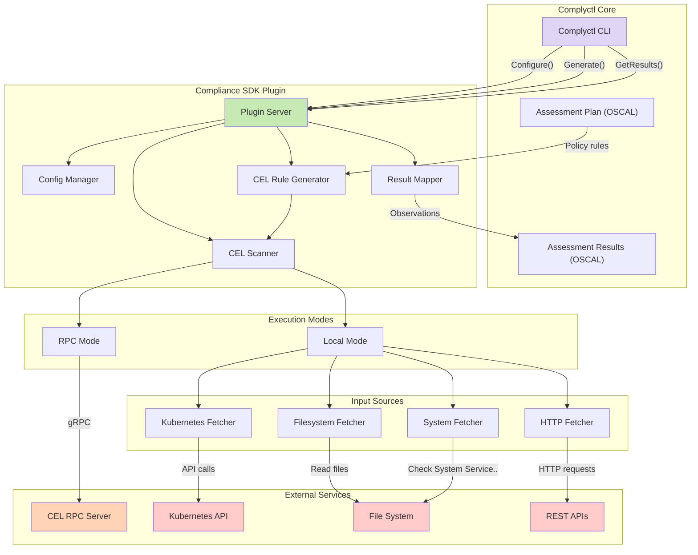
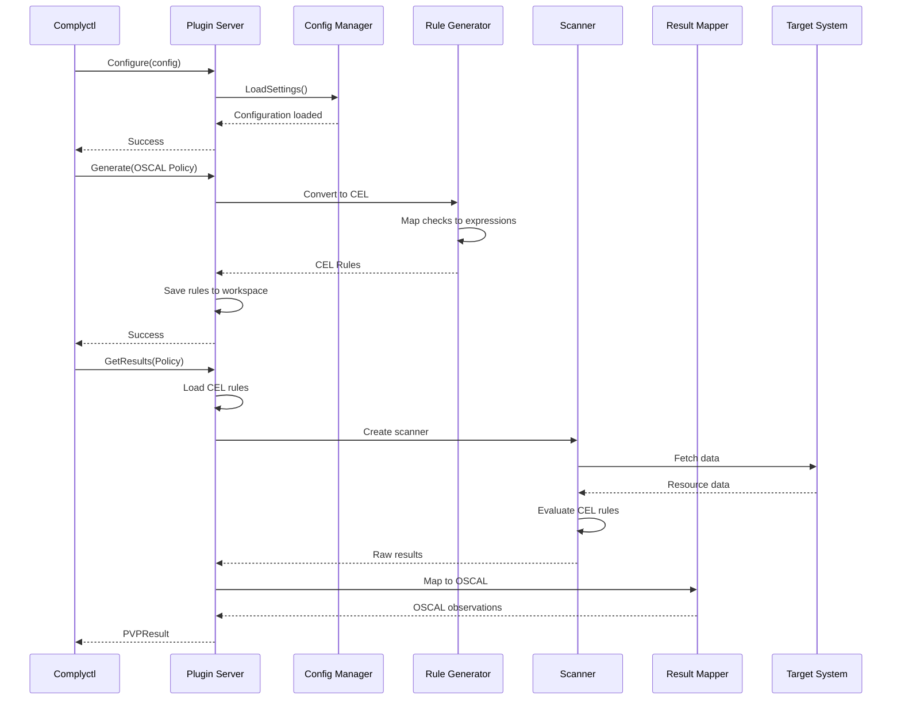

# compliance-sdk Plugin for Complyctl

## Overview

The **compliance-sdk-plugin** extends complyctl's capabilities to use compliance-sdk go module for compliance validation. This plugin integrates with the CEL Go Scanner and optionally with the CEL RPC Server to provide flexible, policy-as-code compliance checking.

## YAML-Based Rule Storage

The plugin includes a comprehensive YAML-based rule storage system that provides:

### Rule Management Features
- **Individual Storage**: Each rule stored as a separate YAML file for easy version control
- **Batch Operations**: Import and export multiple rules at once
- **Flexible Filtering**: Query rules by category, severity, tags, or check ID
- **Automatic Conversion**: Seamless conversion between stored format and CEL scanner objects

### Rule Format Example
```yaml
id: sshd-service-enabled
name: SSH Daemon Service Enabled Check
description: Ensures SSH daemon service is enabled to start at boot
expression: 'service.success && contains(service.output, "enabled")'
inputs:
  - name: service
    type: system
    command: systemctl
    args: [is-enabled, sshd]
tags: [security, compliance, ssh]
category: system-services
severity: HIGH
extensions:
  compliance_framework: CIS
  control_id: "5.2.1"
  remediation: "Run 'sudo systemctl enable sshd' to enable SSH service"
```

### Rule Store API Usage
```go
// Create a new rule store
store, err := NewRuleStore("/path/to/rules")

// Save a rule
rule := &StoredRule{
    ID: "custom-check",
    Name: "Custom Security Check",
    Expression: "resource.status == 'secure'",
    // ... other fields
}
store.Save(rule)

// List rules with filtering
rules := store.List(map[string]string{
    "category": "security",
    "severity": "HIGH",
})

// Export rules
store.ExportRules([]string{"rule1", "rule2"}, "export.yaml")

// Import rules
store.ImportRules("rules.yaml", false) // false = skip existing
```

## Architecture Design

### High-Level Architecture

The Compliance SDK Plugin follows a modular architecture that seamlessly integrates with complyctl's plugin framework while providing flexible execution modes and input sources.



### Component Architecture

#### 1. **Plugin Server (Core Component)**
The Plugin Server is the main entry point that implements the `policy.Provider` interface:

- **Responsibilities**:
  - Handles gRPC communication with complyctl
  - Orchestrates the conversion between OSCAL and CEL
  - Manages execution modes (local vs RPC)
  - Coordinates all sub-components

- **Key Methods**:
  - `Configure()`: Initializes plugin settings and connections
  - `Generate()`: Transforms OSCAL rules to CEL expressions
  - `GetResults()`: Executes scans and returns compliance results

#### 2. **Config Manager**
Manages all plugin configuration:

- **Configuration Categories**:
  - **Files**: Workspace paths, mapping files, output locations
  - **Parameters**: Target details, profiles, namespaces
  - **CEL Server**: RPC connection settings, TLS configuration
  - **Features**: Enable/disable various input sources
  - **Scanner**: Debug settings, resource filters

#### 3. **CEL Rule Generator**
Converts OSCAL compliance rules to CEL expressions:

- **Mapping Process**:
  1. Parses OSCAL rule definitions
  2. Maps checks to CEL expressions via configuration
  3. Preserves metadata as CEL rule extensions
  4. Handles parameters and variable substitution

- **Mapping Sources**:
  - Built-in mappings for common checks
  - Custom mapping files (JSON format)
  - Future: AI-generated mappings

#### 4. **CEL Scanner**
Executes CEL expressions against targets:

- **Execution Modes**:
  - **Local Mode**: Direct evaluation using embedded CEL engine
  - **RPC Mode**: Delegates to CEL RPC Server for evaluation
  - **Hybrid Mode**: Chooses mode based on rule requirements

- **Scanner Creation**:
  ```go
  // Local scanner with composite fetcher
  scanner := celscanner.NewScanner(compositeFetcher, logger)
  
  // RPC scanner using gRPC client
  scanner := createRPCScanner(celRPCClient)
  ```

#### 5. **Result Mapper**
Transforms CEL evaluation results to OSCAL format:

- **Mapping Logic**:
  - CEL `CheckResultPass` → OSCAL `RESULT_PASS`
  - CEL `CheckResultFail` → OSCAL `RESULT_FAILURE`
  - CEL `CheckResultError` → OSCAL `RESULT_ERROR`
  
- **Result Structure**:
  - Observations by check ID
  - Subject details (target info)
  - Timestamps and methods
  - Evidence references

### Data Flow Architecture

1. **Configuration Flow**:
   ```
   Manifest → Configure() → Config Manager → All Components
   ```

2. **Generation Flow**:
   ```
   OSCAL Assessment Plan → Generate() → Rule Generator → CEL Rules → Storage
   ```

3. **Execution Flow**:
   ```
   CEL Rules → Scanner → Fetchers → Target Systems → Results
   ```

4. **Results Flow**:
   ```
   Raw Results → Result Mapper → OSCAL Observations → Assessment Results
   ```

### Plugin Integration Architecture

The plugin uses HashiCorp's go-plugin framework for secure communication:

```go
// Plugin registration
pluginMap := map[string]plugin.Plugin{
    plugin.PVPPluginName: &plugin.PVPPlugin{Impl: complianceSDKPlugin},
}

// gRPC communication
service PolicyEngine {
    rpc Configure(ConfigureRequest) returns (ConfigureResponse);
    rpc Generate(PolicyRequest) returns (GenerateResponse);
    rpc GetResults(PolicyRequest) returns (ResultsResponse);
}
```

### Security Architecture

1. **Plugin Isolation**:
   - Runs as separate process
   - Communication via gRPC only
   - No shared memory with complyctl

2. **Authentication & Authorization**:
   - TLS support for CEL RPC Server
   - Kubernetes RBAC for K8s fetcher
   - File permissions for filesystem access

3. **Data Protection**:
   - Sensitive data never logged
   - Results stored with restricted permissions
   - Optional encryption for stored rules

### Extensibility Architecture

The plugin is designed for easy extension:

1. **New Input Sources**:
   - Implement the Fetcher interface
   - Add configuration options
   - Register in scanner builder

2. **Custom Mappings**:
   - JSON-based mapping files
   - Programmatic mapping functions
   - Future: Plugin-based mappers

3. **Result Formats**:
   - Current: OSCAL Assessment Results
   - Extensible to other formats via interfaces

### Workflow Sequence Diagram



### Directory Structure

```
compliance-sdk-plugin/
├── main.go                    # Plugin entry point
├── go.mod                     # Go module definition
├── Makefile                   # Build and test automation
├── README.md                  # This documentation
│
├── server/                    # Plugin server implementation
│   ├── server.go             # Core plugin logic
│   └── server_test.go        # Unit tests
│
├── config/                    # Configuration management
│   ├── config.go             # Config structures and validation
│   └── config_test.go        # Config tests
│
├── mapper/                    # OSCAL-CEL mapping (future)
│   ├── mapper.go             # Mapping logic
│   └── mappings/             # Mapping definitions
│
├── examples/                  # Example configurations
│   ├── manifest.yaml         # Sample manifest
│   ├── mappings.json         # Sample mappings
│   └── rules/                # Sample CEL rules
│
└── test/                      # Integration tests
    ├── integration_test.go   # Full workflow tests
    └── fixtures/             # Test data
```

### Deployment Architecture

The Compliance SDK Plugin supports multiple deployment scenarios:

#### 1. **Standalone Deployment**
```
┌─────────────┐     ┌───────────────────────┐
│  Complyctl  │────▶│ Compliance-SDK Plugin │
└─────────────┘     └───────────────────────┘
                             │
                    ┌────────┴────────┐
                    ▼                 ▼
              Local Scanner      Target System
```


#### 2. **Kubernetes Deployment**
```yaml
apiVersion: v1
kind: ConfigMap
metadata:
  name: celscanner-config
data:
  config.yaml: |
    enable_kubernetes: true
    use_rpc_server: true
    cel_server_address: cel-rpc-server:50051
---
apiVersion: batch/v1
kind: Job
metadata:
  name: compliance-scan
spec:
  template:
    spec:
      serviceAccountName: celscanner
      containers:
      - name: complyctl
        image: complytime/complyctl:latest
        command: ["complyctl", "scan", "-m", "/config/manifest.yaml"]
        volumeMounts:
        - name: config
          mountPath: /config
      volumes:
      - name: config
        configMap:
          name: celscanner-config
```

### Comparison with OpenSCAP Plugin

| Feature | OpenSCAP Plugin | CELScanner Plugin |
|---------|----------------|-------------------|
| **Expression Language** | XCCDF/OVAL | CEL (Common Expression Language) |
| **Execution Model** | System binary (oscap) | Embedded or RPC |
| **Target Systems** | Linux systems | Kubernetes, APIs, Files, Systems |
| **Rule Format** | XML-based | JSON/YAML with CEL |
| **Performance** | Process-based | In-memory evaluation |
| **Extensibility** | Limited to SCAP | Highly extensible |
| **Cloud Native** | Limited | First-class support |
| **Custom Rules** | Complex XML | Simple CEL expressions |
| **AI Integration** | Not supported | Future: LLM rule generation |

## Core Interfaces

The plugin implements the `policy.Provider` interface from `compliance-to-policy-go/v2`:

```go
type Provider interface {
    Configure(configMap map[string]string) error
    Generate(policy Policy) error
    GetResults(policy Policy) (PVPResult, error)
}
```

### Internal Interfaces

```go
// Fetcher interface for data sources
type Fetcher interface {
    FetchInputs(inputs []Input, metadata map[string]interface{}) (map[string]interface{}, error)
}

// Logger interface for plugin logging
type Logger interface {
    Debug(msg string, args ...interface{})
    Info(msg string, args ...interface{})
    Warn(msg string, args ...interface{})
    Error(msg string, args ...interface{})
}

// RuleMapper interface for OSCAL to CEL conversion
type RuleMapper interface {
    MapCheck(checkName string) (expression string, inputs []Input)
    LoadMappings(path string) error
}
```

## Features

### 1. Multiple Execution Modes
- **Local Mode**: Uses embedded CEL scanner for direct evaluation
- **RPC Mode**: Connects to CEL RPC Server for distributed scanning
- **Hybrid Mode**: Can use both modes based on rule requirements

### 2. Multiple Input Sources
- **Kubernetes**: Scan Kubernetes resources (Pods, Deployments, Services, etc.)
- **Filesystem**: Validate configuration files and system files
- **HTTP**: Check REST API endpoints and responses
- **System**: Limited to service status checks only (systemctl, getenforce) for security

### 3. OSCAL Integration
- Converts OSCAL Component Definitions to CEL rules
- Maps CEL validation results back to OSCAL Assessment Results
- Supports OSCAL parameters and rule metadata

## Configuration

The plugin accepts configuration through the manifest file:

```yaml
plugin:
  name: compliance-sdk-plugin
  config:
    # Workspace configuration
    workspace: /tmp/complyctl-workspace
    
    # Target information
    target_name: "my-kubernetes-cluster"
    target_type: "kubernetes-cluster"
    target_id: "cluster-001"
    
    # Feature flags
    enable_kubernetes: true
    enable_filesystem: true
    enable_http: false
    enable_system: false
    
    # CEL RPC Server (optional)
    use_rpc_server: true
    cel_server_address: "localhost:50051"
    cel_server_timeout: 30
    
    # Scanner configuration
    enable_debug_logging: false
    include_namespaces: "default,kube-system"
    resource_types: "pods,deployments,services"
```

## How It Works

### 1. Generate Phase

When complyctl calls `Generate()`:

1. The plugin receives OSCAL rules from the assessment plan
2. Each OSCAL rule is converted to a CEL expression:
   - Rule metadata is preserved as extensions
   - Parameters are embedded in the CEL context
   - Checks are mapped to CEL expressions via configuration
3. CEL rules are saved to the workspace for execution

### 2. Scan Phase

When complyctl calls `GetResults()`:

1. The plugin loads the generated CEL rules
2. Creates a scanner based on configuration:
   - Local scanner with appropriate fetchers
   - Or RPC client connection
3. Executes all CEL rules against the target
4. Converts results to OSCAL observations

### 3. Result Mapping

CEL results are mapped to OSCAL as follows:
- `CheckResultPass` → `RESULT_PASS`
- `CheckResultFail` → `RESULT_FAILURE`
- `CheckResultError` → `RESULT_ERROR`

Each observation includes:
- The original check ID
- Execution timestamp
- Target information (name, type, ID)
- Pass/fail status and reasons

## Integration with CEL RPC Server

When using the CEL RPC Server mode:

1. The plugin connects to the server via gRPC
2. Rules can reference the server's rule library
3. Test cases can be executed for validation
4. Results include detailed compliance information

## Example Workflow

```bash
# 1. Configure the plugin in your manifest
cat > manifest.yaml <<EOF
assessment-plan: assessment-plan.json
plugins:
  - name: compliance-sdk-plugin
    config:
      workspace: /tmp/compliance
      enable_kubernetes: true
      target_name: production-cluster
EOF

# 2. Generate CEL rules from OSCAL
complyctl generate -m manifest.yaml

# 3. Run compliance scan
complyctl scan -m manifest.yaml

# 4. View results
complyctl report -m manifest.yaml
```

## System Service Status Checks

For security reasons, system command execution is limited to service status checks only. The plugin supports:

- **Service Status**: Check if a service is running (`systemctl is-active <service>`)
- **Service Enabled**: Check if a service is enabled (`systemctl is-enabled <service>`)
- **SELinux Status**: Check SELinux enforcement mode (`getenforce`)

Example system service mappings:
```yaml
sshd-service-enabled:
  expression: "service.output.contains('enabled')"
  description: "SSH daemon service should be enabled"
  inputs:
    - name: service
      type: system
      command: "systemctl is-enabled sshd"

firewalld-running:
  expression: "service.output.contains('active')"
  description: "Firewalld should be running"
  inputs:
    - name: service
      type: system
      command: "systemctl is-active firewalld"
```

### Security Considerations

- System commands are restricted to specific service status commands
- No arbitrary command execution is allowed
- Commands are validated before execution
- Results are parsed to extract only status information

### Implementation Details

The plugin follows the cel-go-scanner pattern for system inputs:
- Service status checks use: `WithSystemInput(name, "", "systemctl", []string{"is-active", service})`
- Service enabled checks use: `WithSystemInput(name, "", "systemctl", []string{"is-enabled", service})`
- SELinux checks use: `WithSystemInput(name, "", "getenforce", []string{})`
- Direct service checks use: `WithSystemInput(name, serviceName, "", []string{})`

The expressions validate both command success and output content:
```cel
service.success && contains(service.output, "active")
```

This ensures that:
1. The command executed successfully (`service.success`)
2. The output contains the expected status string

## CEL Expression Mapping System

The plugin uses an advanced mapping system to convert OSCAL RuleSets to CEL rules:

### Key Features
- **One-to-Many Mapping**: One RuleSet can map to multiple CEL rules
- **Flexible Sources**: Use stored rules or inline definitions
- **Hierarchical Lookup**: Map by RuleSet ID or individual Check IDs

### Mapping Configuration Example
```yaml
# mappings.yaml
version: "1.0"
mappings:
  # Map to stored rules
  sshd-service:
    type: stored_rules
    rule_ids:
      - sshd-service-enabled
      - sshd-service-running
  
  # Map to inline rules
  pod-security:
    type: inline
    rules:
      - id: pod-security-context
        expression: "has(resource.spec.securityContext)"
        inputs:
          - name: resource
            type: kubernetes
            resource: pods
```

See [Mapping System Documentation](docs/mapping-system.md) for detailed information.

## Development

### Building the Plugin

```bash
cd compliance-sdk-plugin
go build -o compliance-sdk-plugin
```

### Testing

The plugin includes comprehensive test coverage with both unit tests and integration tests.

#### Unit Tests

Run unit tests with mocked dependencies:

```bash
make test
```

Run tests with coverage report:

```bash
make test-coverage
```

#### Integration Tests

Integration tests require access to a live Kubernetes cluster. They automatically discover kubeconfig using standard Kubernetes conventions (KUBECONFIG environment variable, ~/.kube/config, or in-cluster config).

Run integration tests:

```bash
make test-k8s
```

Run with specific kubeconfig:

```bash
make test-k8s-config    # Uses kubeconfig from KUBECONFIG env var or ~/.kube/config
# or
KUBECONFIG=/path/to/kubeconfig make test-k8s
```

Run all tests (unit + integration):

```bash
make test-all
```

#### Test Features

1. **Mock Testing**: Unit tests use mocked Kubernetes clients and scanner
2. **Live Cluster Testing**: Integration tests validate against real Kubernetes resources
3. **YAML Format Testing**: Verifies correct YAML serialization/deserialization
4. **Custom Mapping Testing**: Tests loading and applying custom CEL expression mappings
5. **Performance Testing**: Includes benchmarks for rule generation

#### Test Workspace Configuration

Tests use a temporary workspace by default to avoid modifying the examples directory. You can override this behavior:

```bash
# Use default temp workspace (recommended)
go test ./server

# Use a specific workspace directory
TEST_WORKSPACE=/path/to/workspace go test ./server

# Integration tests with custom workspace
TEST_WORKSPACE=/tmp/my-test-workspace make test-k8s
```

The test workspace setup:
- Creates a temporary directory by default
- Copies example rules and mappings from `../examples`
- Creates required subdirectories (`celscanner/policy`, `celscanner/results`, `rules`)
- Cleans up automatically after tests complete

#### Writing Tests

When adding new features, ensure to:
- Add unit tests in `*_test.go` files
- Add integration tests in `*_integration_test.go` files with `//go:build integration` tag
- Test both success and failure scenarios
- Include YAML format validation for any data structures

### Adding New Fetchers

To add support for new input sources:

1. Implement the fetcher in the celscanner library
2. Add configuration options in `config/config.go`
3. Update the scanner creation logic in `server/server.go`

## Future Enhancements

1. **Dynamic Rule Generation**: Use AI/LLM to generate CEL expressions from natural language policies
2. **Rule Library Integration**: Direct integration with CEL RPC Server's rule library
3. **Multi-cluster Support**: Scan multiple Kubernetes clusters in parallel
4. **Policy Templates**: Pre-built CEL rules for common compliance frameworks
5. **Real-time Monitoring**: Continuous compliance checking with webhooks

## License

This plugin is licensed under the Apache-2.0 License.